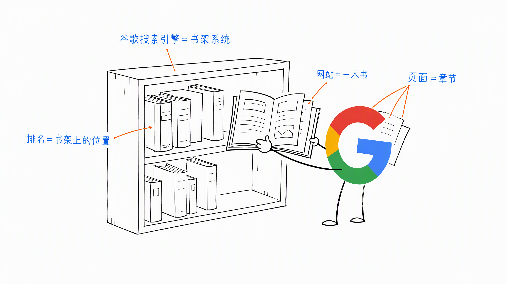
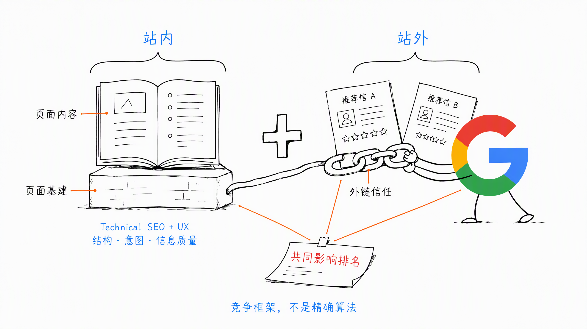
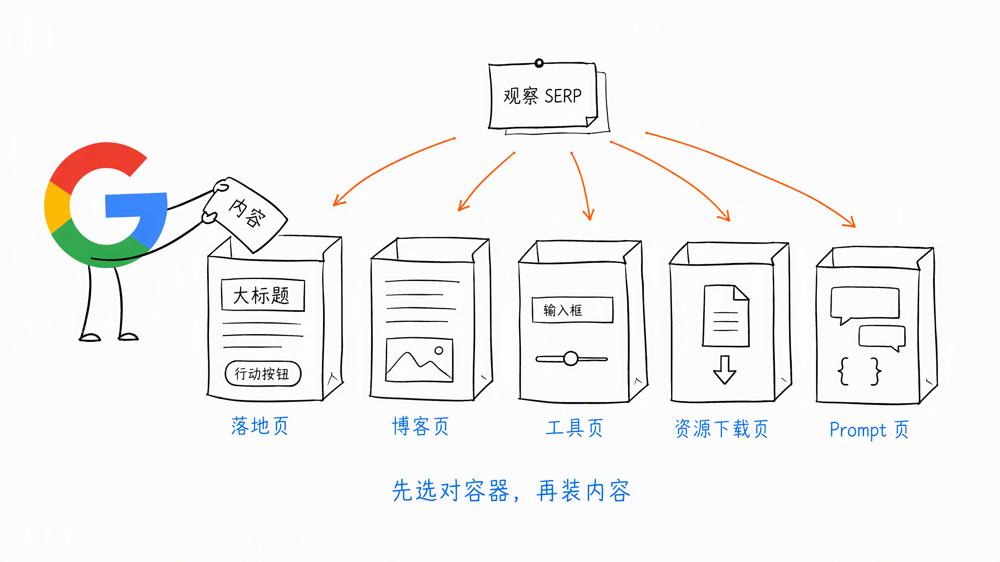
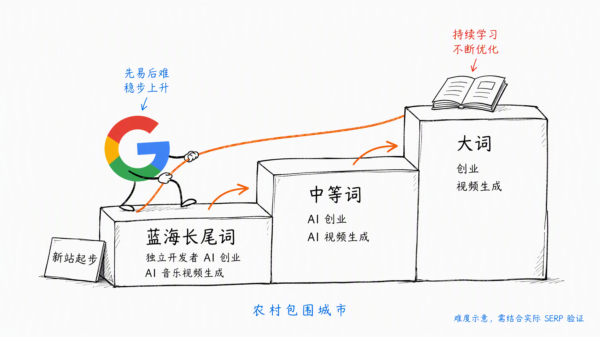
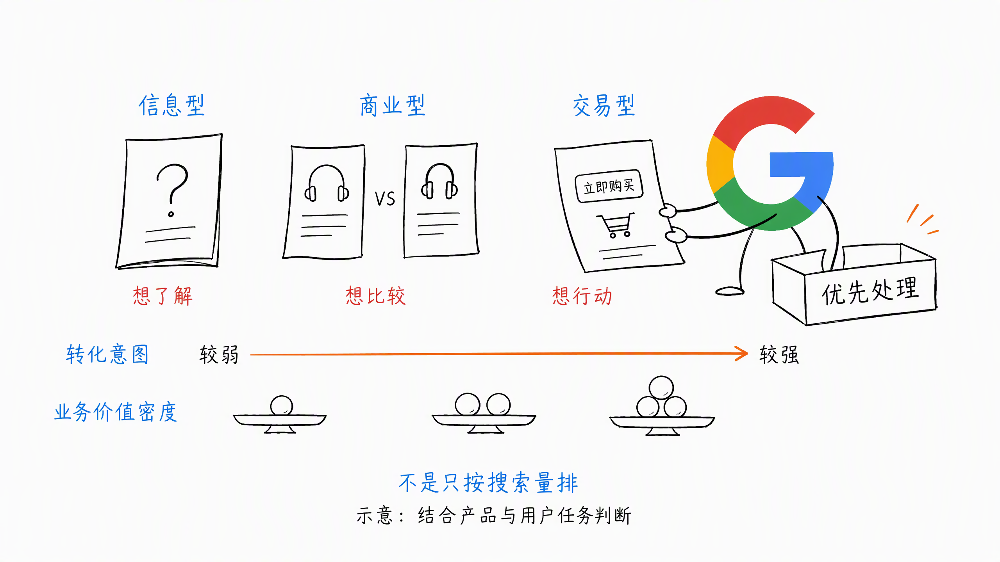
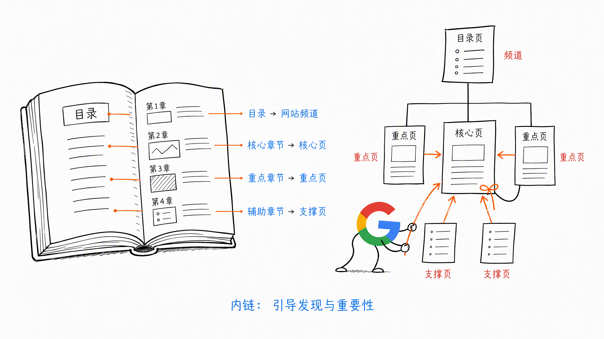
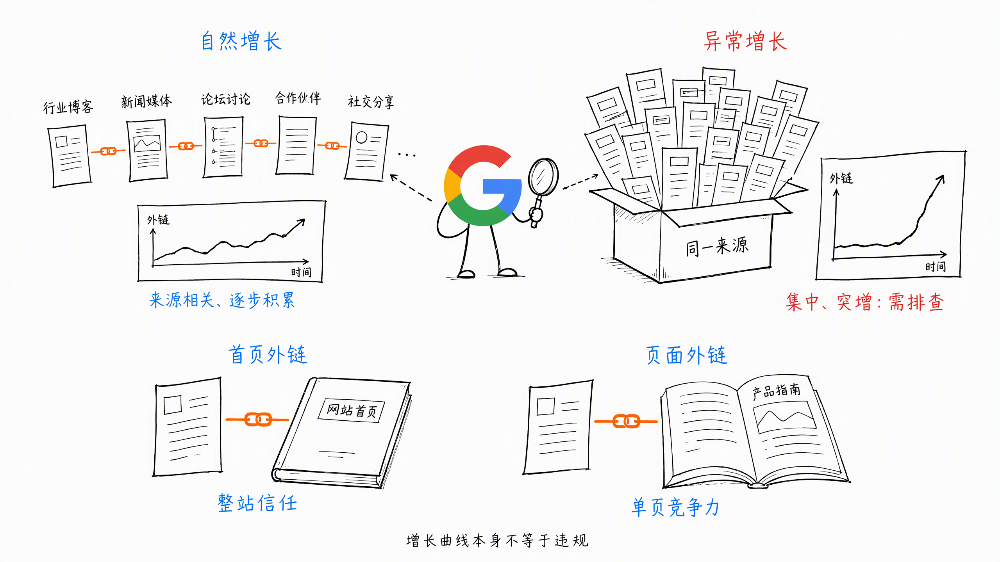

# 第 1 章 SEO 不是排名技巧，是一套增长系统

> ❤️ 这一章节内容，感谢 Joker 当时分享的关键词搜索意图，非常赞！

## 一、你眼中的谷歌 SEO

很多人理解的谷歌 SEO 很简单：

- 有排名 = 有流量
- 排名靠前 = 自然流量

所以：SEO = 排名。

从结果层面看没错，但从系统层面看，可以换一个更直观的模型这样理解：

- 谷歌搜索引擎 = 书架系统
- 你的网站 = 一本书
- 你的网站页面 = 书的章节

**SEO 排名 = 你的书 / 章节在书架上的位置。**

**SEO 的本质即是写文章，但也是让你的书和章节在书架系统里获得更靠前的位置。**

## 二、SEO 核心公式是什么？

**谷歌 SEO 排名 =（页面内容 + 页面基建）+ 外链**

拆开就是：

- 站内
  - 页面基建（Technical SEO + UX）
  - 页面内容（结构 + 搜索意图 + 信息质量）
- 站外
  - 外链（信任投票系统）

这是一个完整的 SEO 竞争框架，不是单点优化问题。

### 2.1 页面基建（SEO 的地基系统）

谷歌是网页搜索引擎，本质是爬虫 + 页面理解系统。

如果你的网页：

- 打不开 / 加载慢
- 结构混乱 / 适配差
- 稳定性差

**相当于你的书质量很差，翻都翻不动！那连上书架的资格都没有，更谈不上排名。**

这就是 **Technical SEO 的本质意义**：不是优化排名，而是**保证可索引、可理解、可使用**。

核心维度包括：

- 页面性能
  - 前端加载
  - 后端响应
  - CDN
  - 服务稳定性
- 结构系统
  - URL 结构
  - 目录层级
  - 内链结构
- 设备体验
  - 响应式适配
- 多语言
  - lang
  - hreflang
- 语义结构
  - 结构化数据
  - Schema 自动化
- 其他
  - robots.txt
  - sitemap.xml
  - 404 / 重定向处理

这些东西的特点只有一个：

- **基本是一次性工程**
- **是系统地基，不是内容产出型工作**

网站大改版才会重新 Check & 修复，不是日常 SEO 动作。

### 2.2 页面内容（SEO 的核心竞争力）

#### a. 页面形式（Content Type）

页面首先要解决的是：**装内容的容器是什么形态。**

比如：

- 落地页
- 博客页
- 工具页
- 资源下载页
- Prompt 页
- ……

这个不是你决定的，是谷歌 **SERP 决定的**：**SERP 前排是什么页面形态，你就做什么形态。**

这是 Google 的内容结构喜好逻辑，不是创作者偏好。

#### b. 搜索词决定竞争难度

搜索词本身就是竞争等级系统：

- 排名难度大的词：创业、视频生成
- 排名难度中的词：AI 创业、AI 视频生成
- 蓝海词：独立开发者 AI 创业、AI 音乐视频生成

新站逻辑，推荐**农村包围城市策略**：**蓝海词 → 中等词 → 大词。**

不是战略选择，是竞争游戏的优先级选择逻辑。

#### c. 搜索意图决定优先级

搜索意图决定的不是能不能做，而是：

- 做不做
- 先做哪个
- 做成什么形态
- 投入资源值不值

信息类、交易类、商业类，本质是**用户价值密度**不同。

零点击时代，本质变化就是：

- 信息型价值密度下降
- 决策型、交易型价值密度上升

所以关键词优先级不是按搜索量排，是按**转化意图强度排**。

#### d. 关键词研究决定站点结构

第一阶段的关键词 Research 不是写内容，而是定结构。

决定：

- `/tools`
- `/blogs`
- `/resources`
- `/docs`
- `/models`
- `/api`
- ……

这不是 SEO 技术问题，是页面**信息架构问题**。SEO 本质不是页面工程，是**内容系统工程**。

#### e. SEO 内容创作的核心目标

不是写文章，而是同时满足两个系统：

- 搜索引擎理解
- 用户搜索价值

所有内容必须同时满足：

- Google 能理解
- 用户能通过内容解决真实问题

这也是为什么要做：

- 页面结构化（H1、H2、H3）
- 模块化（功能、模板、FAQ、How to Use）
- 意图匹配（页面类型匹配搜索意图）
- 信息密度控制（不是堆字数）

#### f. 内链本质

内链不是 SEO 技巧，是**权重引导系统**。

比如一个网站有 1 万个页面，Google 不可能认为 1 万个页面同等重要。

内链的本质是告诉 Google：

- 哪些是核心章节
- 哪些是次级章节
- 哪些是支撑内容

这就像一本书：

- 目录结构
- **核心章节**
- **重点章节**
- 辅助章节

## 三、外链（站外信任系统）

SEO 排名结构 =

- 站内：内容 + 基建
- 站外：外链

外链本质是**信任投票系统**。

外链的作用：

1. 排名提升：提升关键词页面在 SERP 中的权重竞争力
2. 引荐流量：导入真实用户，不是爬虫信号
3. 发现与收录：外链 = 给爬虫修路。比如新站新页，有外链比只交 sitemap 更快收录

外链简单可以分两类：

- 首页外链：提升整站权重基数，影响全站各个页面的排名
- 页面外链：提升单页竞争力，用于打核心关键词页

外链必须是**自然增长模型**。如果一个新站：

- 短时间大量新增高质量外链
- 来源结构异常集中
- 增长曲线异常陡峭

结果只有一个：

不是提升，是风控触发。

## 四、总结一句话

SEO 不是优化页面，SEO 是页面内容参与一个竞争系统。

这个系统由三部分组成：

- 技术系统（页面能不能被理解）
- 内容系统（用户和 Google 是否认可）
- 信任系统（外部世界是否投票给你）

不是运营技巧，是系统工程。

不是写文章，是构建内容产品。

不是做 SEO 项目，是做一个能在搜索系统里长期竞争的内容型产品体系。

如果要压缩成一句话作为方法论总结：

**谷歌 SEO 不是排名技术，而是内容系统 + 信任系统 + 结构系统的长期竞争工程。**

> 本章节完毕，谢谢大家，欢迎随时讨论。
