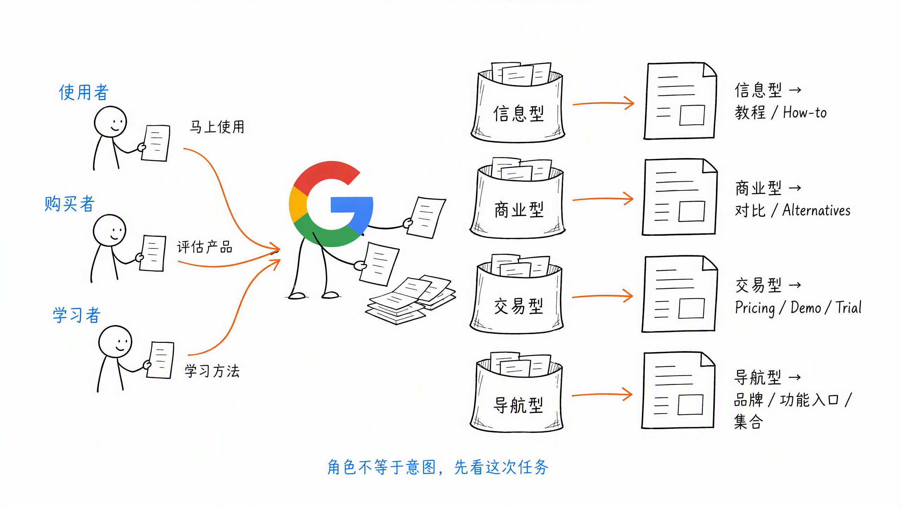
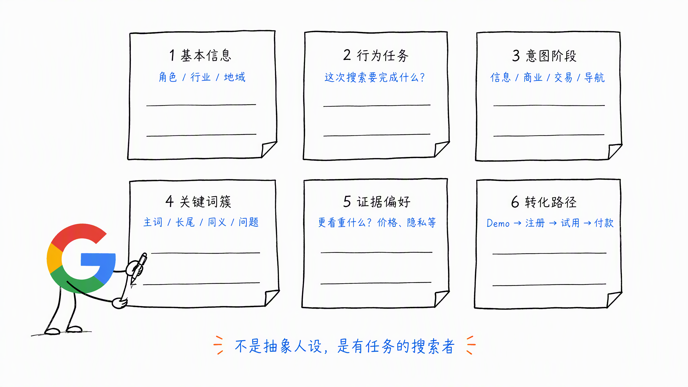

# 第 2 章 找到你的 SEO 理想用户画像

SEO 的 ICP（Ideal Customer Profile），就是在搜索框输入与你业务高度相关关键词的客群。

重点是先理清楚：

- 谁在搜
- 为啥搜
- 搜完后需要找到什么

然后再决定做什么页面，以及下一步 CTA 转化如何设计。

因此，**在正确的搜索用户面前展示正确的页面，是第一步，也是最重要的一步。**

## 一、谁在搜：以 AI 工具网站为例

AI 工具站常见的 3 类搜索用户如下：

- 使用者：要找到马上能用的功能 / 模板等。搜索词比如 AI 批量去背景、3D 视频特效 Prompt 等
- 购买者：一般是技术负责人（DM 或 Dev），要评估对比 / 价格 / API 等。搜索词比如 A vs B、A Alternatives、A Pricing / API 等
- 学习者：要搞清楚是什么、怎么做等最佳实践。搜索词比如 How-to xx、xx Guide 等

确定 SEO 的 ICP，其画像包括行业 / 角色、要完成的目标、搜索过程中的关键行为等。

理清楚这些，才能决定做什么样的页面。大概有 3 个维度：

- Content Type 页面内容类型：比如文章页、产品页、集合页等
- Content Format 页面内容格式：比如教程类、清单类、对比类等
- Content Angle 页面内容角度：比如最新、免费、批量等

有个小技巧，就是先看看 SERP（Search Engine Results Page）美区前 10 个页面的类型 / 格式 / 角度，再决定该做什么页面和什么内容。

以 AI 工具网站为例，常见的页面有：

- 信息型 → 教程 / How-to
- 商业型 → 对比（A vs B）、替代（Alternatives）
- 交易型 → Pricing、Demo / Trial、下载
- 导航型 → 品牌 / 功能入口页、集合页

## 二、如何刻画 SEO 的 ICP

可以根据下面 6 个维度去刻画 SEO 的 ICP：

1. 基本信息：角色 / 行业 / 地域
2. 行为任务：这次搜索要把哪件事完成
3. 意图阶段：Info / Commercial / Transactional / Navigational
4. 关键词簇：主词、长尾、同义词、问题词等
5. 证据偏好：用户更在意哪些维度，这是页面内容角度的方向参考，比如价格、隐私等
6. 转化路径：Demo → 注册 → 试用 → 付款

其中有两个小技巧：

- 如何刻画，不只是 SEO Research 的结论，也得结合产品运营、用户访谈等多个方式，一起确定用户画像
- 有了用户画像，也就有了关键词簇。下一步可以通过 SEM 关键词投放，验证 MVP 的转化和商业化情况。即使效果不佳，也是个好结果，然后继续假设、验证新的 MVP

因此，SEO 的 ICP 不是抽象人设，而是有明确任务的搜索者。

识别 ta 是谁、为啥搜、要在网页把什么事做完，再对齐 SERP 决定页面类型 / 格式 / 角度。

这样产出的页面，既满足人，也满足搜索引擎的底层逻辑。

但大约 20% 的搜索行为比较模糊，可能有很多种含义。

所以做 SEO 运营的人，需要有同理心和共情力。关键是理解你需要的受众，通过掌握 SEO 的理想用户画像，去执行 SEO 方法，更有效地接触和留住这些用户。

> 本章节完毕，谢谢大家，欢迎随时讨论。
