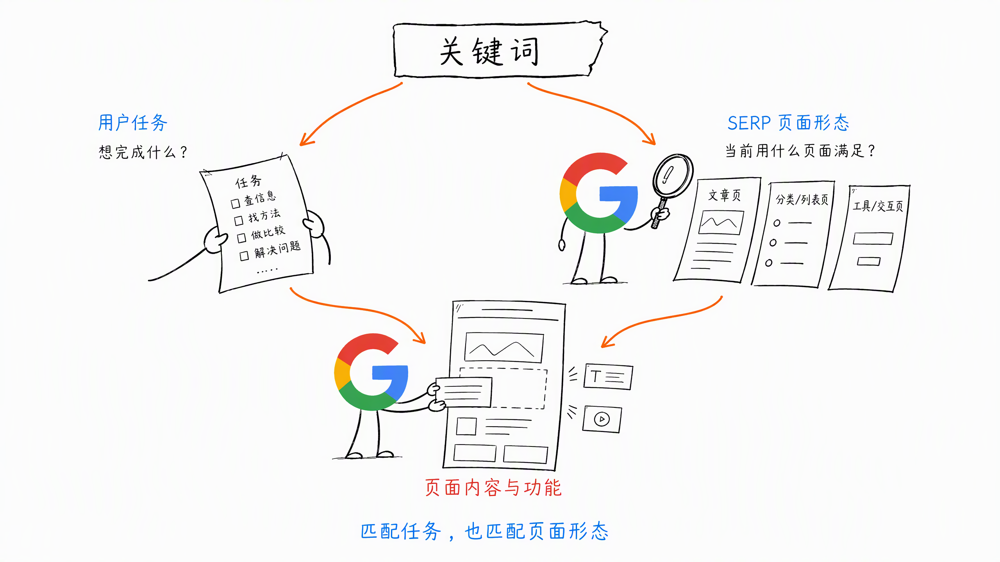
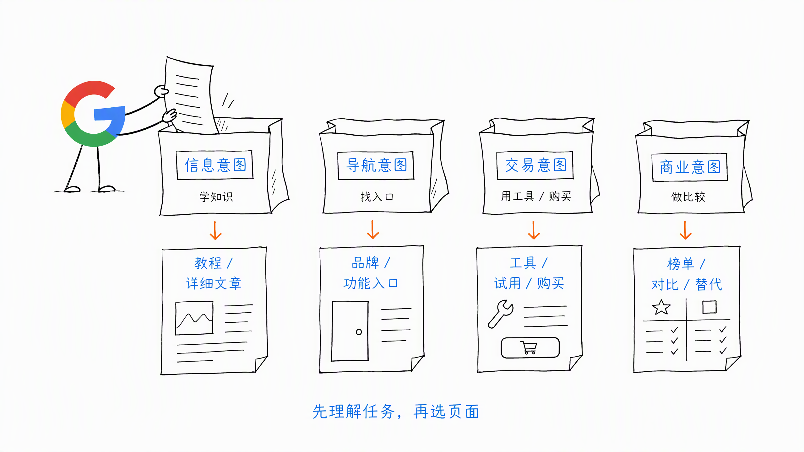
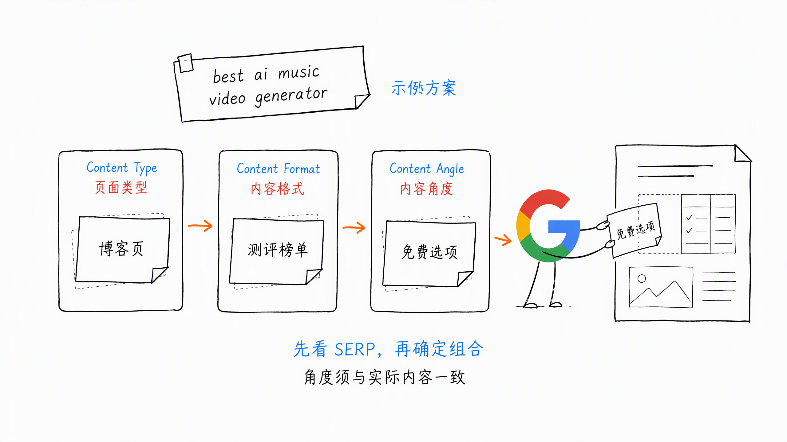
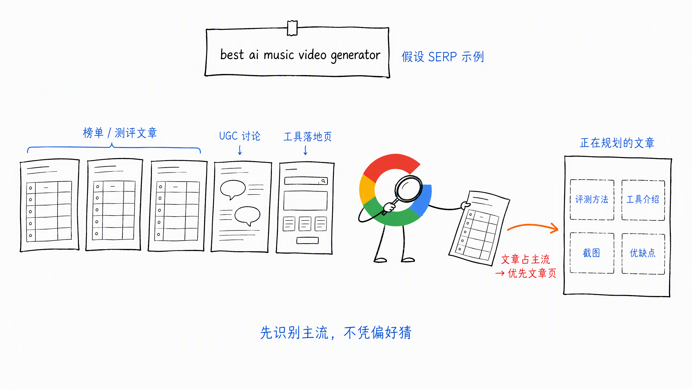
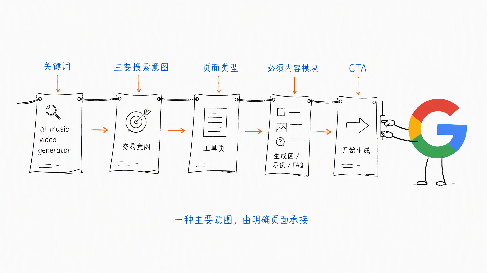
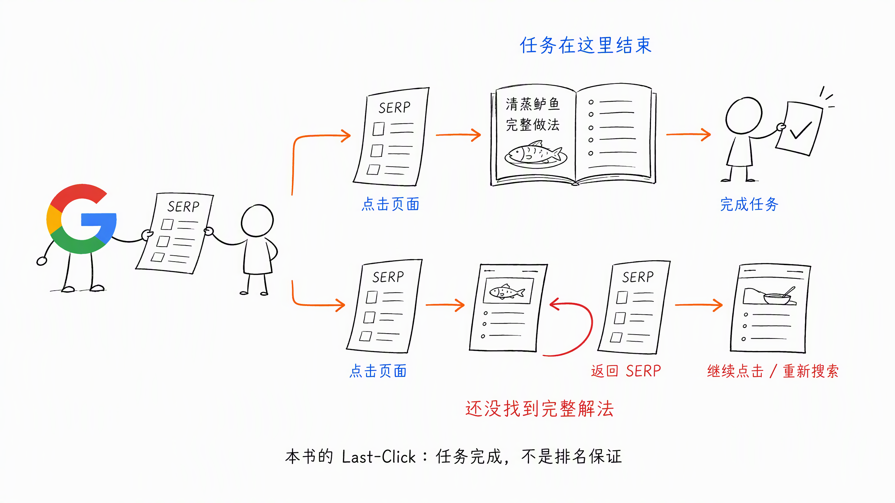
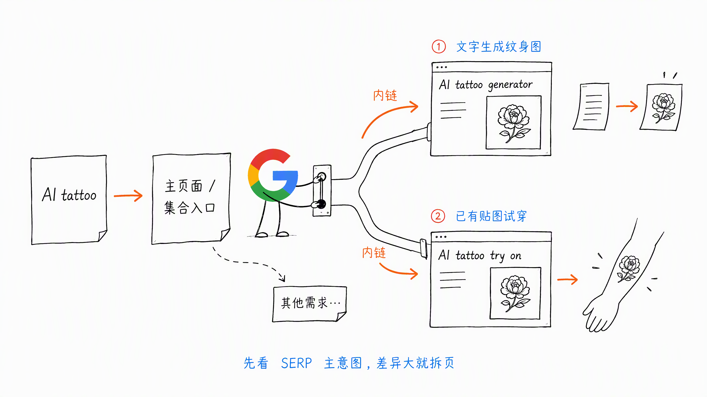

# 第 3 章 搜索意图与 Last-Click

> ❤️ 这一章节内容，感谢 Joker、老猫和《The Art of SEO》带来的启发。

搜索意图，就是用户在搜索框里敲下关键词后，真正想干嘛。

ta 到底想找什么、解决什么问题、完成什么任务？

但只理解用户还不够。还要再看一层：**Google 准备用什么页面形态满足这个任务。**

所以可以把搜索意图理解为：

- 从用户角度看，是用户想完成的任务
- 从 Google 角度看，是该用什么页面类型满足这个任务

**SEO 本质不是匹配关键词，而是匹配关键词背后的用户任务 + Google 认可的页面形态。**

## 一、四类搜索意图

一般会把搜索意图分成四类：

- 信息意图（Informational）：用户在学知识、找信息、做判断，适合教程或详细文章
- 导航意图（Navigational）：用户想找到特定品牌或功能入口，比如 ChatGPT image generator，适合品牌页或功能入口页
- 交易意图（Transactional）：用户想使用工具或购买产品，应该直接提供工具、试用或购买入口
- 商业意图（Commercial）：用户正在做使用或购买决策，适合测评榜单、对比页或替代页

比如 `ai music video generator`，明显更偏交易意图。用户搜索它，大概率不是想了解概念，而是想直接使用工具。

理解这四类意图，至少有两个直接作用：

1. 可以围绕词根，按照搜索意图继续挖掘长尾关键词
2. 可以判断关键词的执行优先级

比如现在零点击越来越多，单纯的信息型内容价值密度可能下降。相对来说，交易意图和商业意图更接近使用与购买。

因此，可以优先关注：

- `ai music video generator`
- `best ai music video generator`

前者更偏交易意图，后者更偏商业意图。

## 二、搜索意图到底有什么用

我先下个结论：

- 搜索意图能帮助大家判断关键词先做哪个、后做哪个
- Google 眼里的搜索意图，决定你用什么页面形式来写
- 用户角度的搜索意图，决定页面里具体写什么、提供什么

### 1. 决定关键词优先级

搜索意图决定的不是一个词能不能做，而是：

- 现在要不要做
- 应该先做哪个
- 应该做成什么页面
- 值不值得投入资源

因此，关键词优先级不能只看搜索量，还要看它背后的转化意图和用户价值密度。

### 2. 决定页面形式

不要自己脑补页面类型。

先看 Google SERP 前排结果：

- 大部分是 Solution / Feature 落地页，优先考虑产品解决方案或功能页
- 大部分是在线工具页（Tools），优先考虑让用户直接完成任务的工具页
- 大部分是 Blog 教程文章，优先考虑教程、指南或测评类文章

**什么页面形式多，就优先做什么页面形式。**

不同意图，也不应该硬塞进同一个页面。

### 3. 决定页面内容

页面形式确定以后，还要决定具体写什么。

常见的 3 个维度是：

- Content Type：内容类型，比如博客页、工具页、落地页
- Content Format：内容格式，比如教程、清单、表格、对比
- Content Angle：内容角度，比如最新、免费、批量

其中还要看 SERP 前排页面都在用什么内容角度说服用户点击，以及哪些问题大家还没有讲透。

比如 `best ai music video generator`，SERP 里可能同时出现：

- 测评 / 榜单文章
- Reddit 等 UGC 讨论
- 工具落地页

如果文章和榜单占主流，我就会优先选择文章页面。内容里会包括 Why 模块、评测方法、Top 工具介绍、截图和优缺点等。

## 三、一个关键词可能有多个搜索意图

需要注意，一个核心关键词可能同时匹配多个搜索意图。

比如 `best ai music video generator`：

- 用户可能想先看测评和对比，再决定用哪个工具，属于商业意图
- 用户也可能已经想直接使用工具，属于交易意图

所以 SEO 不是机械地一词一页。

更准确的说法是：**一种主要搜索意图，由一个明确页面负责承接。**

同一个关键词，如果搜索意图不同，可能就是不同的内容产品，不能全部混在一页里硬写。

如果把 SEO 页面当成一个内容产品，搜索意图就是它要承接的用户需求：

- 它先决定页面形态，比如工具页、榜单页、教程页或 UGC 论坛
- 然后决定页面要交付什么内容组件，比如步骤、对比表、评测方法、数据样本和 FAQ

持续执行时，可以在关键词列表后面补充三个字段：

- 搜索意图
- Google SERP 页面形态
- 必须包含的内容模块：工具模块、Feature 模块等

## 四、什么是搜索用户的 Last-Click

**只要有搜索框，就有 SEO。**

无论是小红书、微信搜一搜，还是 Google、百度，只要用户在搜索框里输入内容，ta 一定带着某个目的。

有搜索框，就会有搜索结果。

现在搜索结果里还会出现 AI 信息，比如 Google 的 AI Overview。部分问题不需要点击网站，就已经得到答案，比如查询天气。

但更多时候，用户仍然会点击自然搜索结果，进入网站完成任务。

这个点击，是网站 SEO 获得用户的第一步。

有了点击，Last-Click 的策略才有意义。

本书所说的 Last-Click，可以从两个角度理解：

- 从用户角度看：用户点击你的网站后，不再继续点击其他网站，也没有马上返回搜索结果重新搜索
- 从搜索结果角度看：你的页面解决了这个关键词背后的用户需求

这就像一本教家常菜的书。

今天想做清蒸鲈鱼，你在这本书里已经得到完整解法，就不会再去翻别的书，也不会重新搜索鲈鱼怎么做。

这里的书，就相当于你的网站。

## 五、怎么判断页面有没有做到 Last-Click

我们无法直接确认 Google 判断 Last-Click 时使用的全部信号。

但从网站自己的数据与用户行为，可以观察一些表现：

- 用户有没有快速离开页面
- 用户有没有继续阅读或使用功能
- 页面浏览深度与停留情况怎么样
- 用户有没有完成注册、下载、生成、购买等任务
- 用户是否还需要返回搜索结果继续找答案

这些表现至少能帮助我们判断：页面有没有真正解决搜索意图。

## 六、怎么把页面做到 Last-Click 级别

可以试着把网站当成一本书，也当成一个产品去做。

- 如果是博客类型，就是内容型产品 / 教程型产品
- 如果是功能类型，就是工具型网站

但要记得，用户搜索词往往存在模糊意图。

比如用户搜索 `AI tattoo`：

- 可能想通过文字描述生成纹身图
- 也可能已经有纹身贴图，想把它试穿到手臂或其他部位
- 还可能存在其他需求

这种模糊意图，不要靠猜，可以这样处理：

1. 先看 SERP 前 10，判断 Google 当前把哪个需求当成主意图
2. 如果几个意图差异很大，就拆成独立页面，不要全部塞进一页
3. 用主页面或集合页提供入口，再通过内链把用户带到对应功能

比如可以分别做 `AI tattoo generator` 和 `AI tattoo try on` 页面，各自承接一种明确任务。

网站要尽可能完整地覆盖这一组相关需求，但不代表一个页面要解决所有意图。

我们常说酒香不怕巷子深，但 SEO 不是这样。

产品和内容做得好，更有机会让用户的最后一次点击落在这里，让用户继续试用、留存，最终转化为付费或订阅。

但产品和内容做好，不代表一定能排到自然搜索第一名。

除了内容与体验，还有很多因素会影响排名：

- 外链
- 内链
- On-Page SEO
- Technical SEO

所以 Last-Click 解决的是页面有没有真正承接用户，而不是单独保证排名。

## 七、小结

搜索意图先回答两个问题：

1. 用户到底想完成什么任务
2. Google 当前准备让什么页面形态完成这个任务

它决定关键词优先级、页面形式和具体内容。

Last-Click 则继续回答：用户点击页面以后，事情有没有真的做完。

所以：

- 搜索意图决定应该做什么页面
- 页面内容和产品能力决定能不能解决任务，达到 Last-Click

SEO 赢的不是谁更会写，而是谁更懂用户要完成什么任务，以及该用什么页面去完成它。

> 本章节完毕，谢谢大家，欢迎随时讨论。
